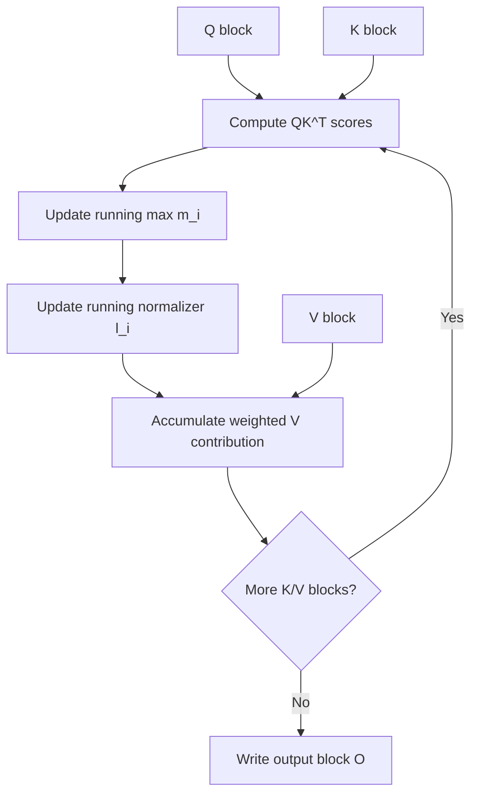
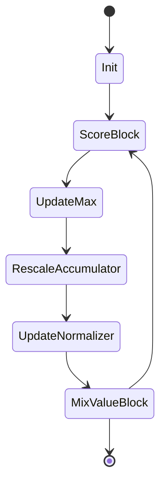
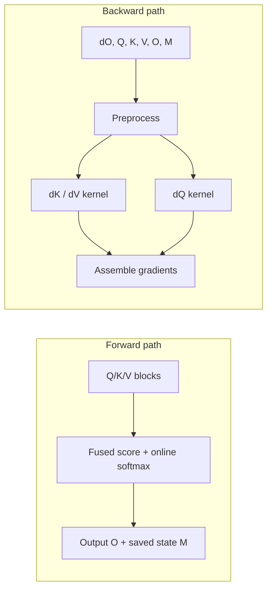
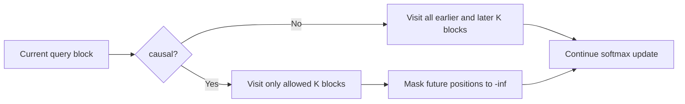

# Tutorial 06: Fused Attention - Quick Reference

## What You're Learning

**Problem:** naive attention materializes the full score matrix and moves too much data through HBM.

**Solution:** stream attention in blocks, maintain an online softmax state, and fuse the score, normalization, and value accumulation steps into Triton kernels.

**Result:** you get FlashAttention-style behavior that trades extra kernel logic for far less memory traffic.

---

## Big-Picture Algorithm

```python
for each Q block:
    for each K/V block:
        scores = Q_block @ K_block.T
        update online max and normalization state
        update output accumulator with V_block
```

The key improvement is that the algorithm never needs to write the full attention matrix to memory.

---

## Streaming Attention Flow



---

## Online Softmax State



`m_i` and `l_i` are the running state variables that let the kernel remain numerically stable without storing all intermediate logits.

---

## Forward / Backward Decomposition



Backward is split because the gradient flow is more complex than forward and benefits from separate blockwise kernels.

---

## Causal Masking



Causal attention changes the traversal and the effective FLOP count, not just a final masking step.

---

## Key Triton Features Used

### 1. Blockwise attention kernels

The notebook uses several Triton kernels instead of one giant function so it can separate forward, backward preprocess, `dK/dV`, and `dQ`.

### 2. Autotuning and hardware-specific branches

The tutorial selects configurations based on head dimension, context length, and GPU generation.

### 3. Tensor descriptors and newer GPU paths

On Hopper and Blackwell-class targets, the implementation can switch into descriptor-driven code paths.

### 4. Online normalization

The kernel updates the softmax state incrementally instead of storing a full score matrix.

---

## Companion Scripts

- `modal_triton_fused_attention.py`: packages the original notebook and runs a compact correctness check plus a few benchmark cases
- `modal_triton_fused_attention_experiments.py`: sequence-length sweep, head-dimension sweep, causal comparison, and warp-specialization check

Because the source notebook is code-dense, the scripts intentionally wrap the notebook implementation instead of copying it line-for-line.

---

## How To Run

### Baseline tutorial runner

```bash
uv run modal run triton_tutorials/06_fused_attention/modal_triton_fused_attention.py
```

### Experiments runner

```bash
uv run modal run triton_tutorials/06_fused_attention/modal_triton_fused_attention_experiments.py
```

---

## What To Inspect

- One backward correctness case against the reference path
- Forward vs backward TFLOPS estimates
- How runtime changes with sequence length
- Whether causal mode or warp specialization changes throughput on the provisioned GPU

---

## Quiz Yourself

1. Why does online softmax need both a running max and a running normalizer?
2. Why is fused attention mostly a memory-traffic optimization?
3. Why is backward split into multiple kernels?
4. What changes when attention becomes causal?

---

## Next Step

Tutorial 08 changes the problem again: instead of one large attention kernel, you schedule many independent GEMMs through a single grouped launch.
