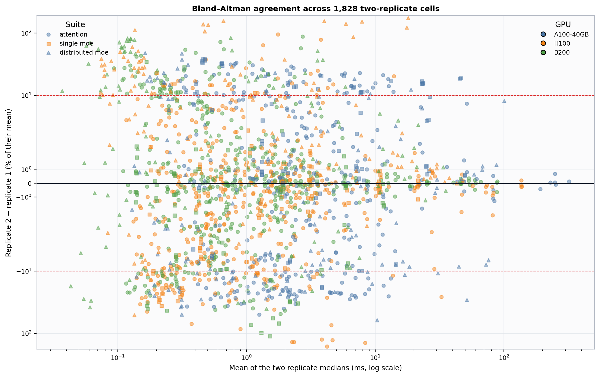
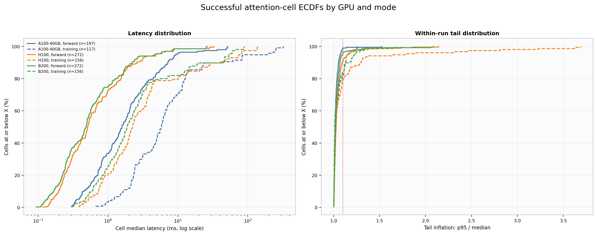
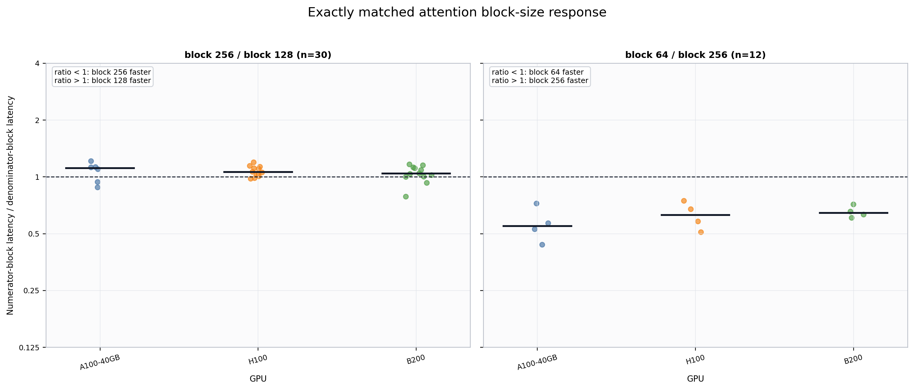
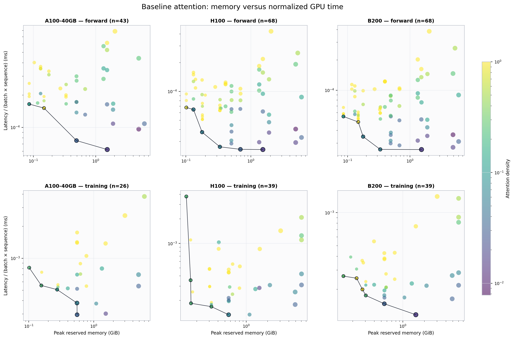
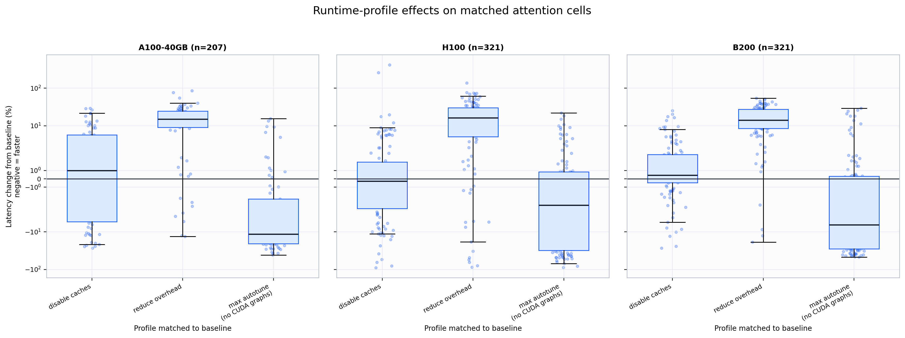
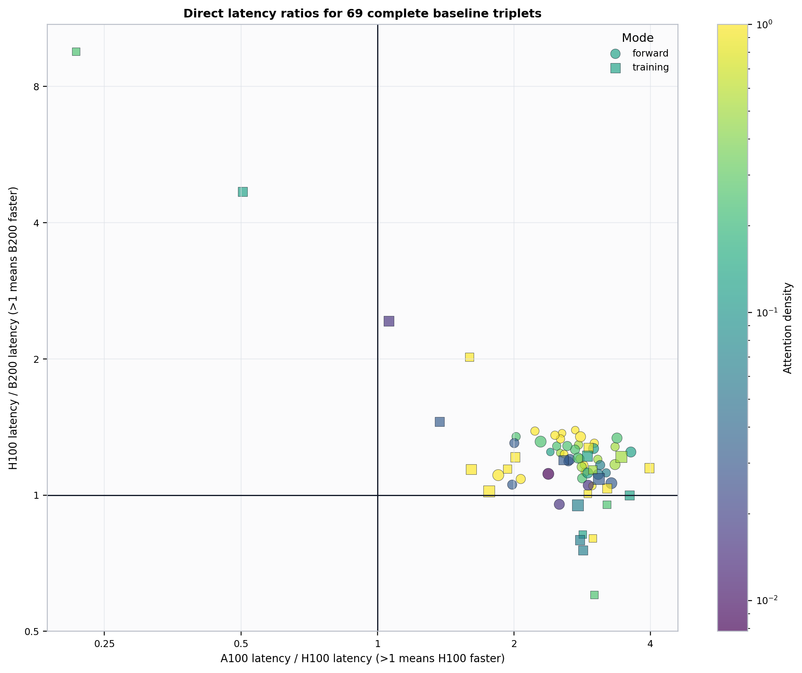
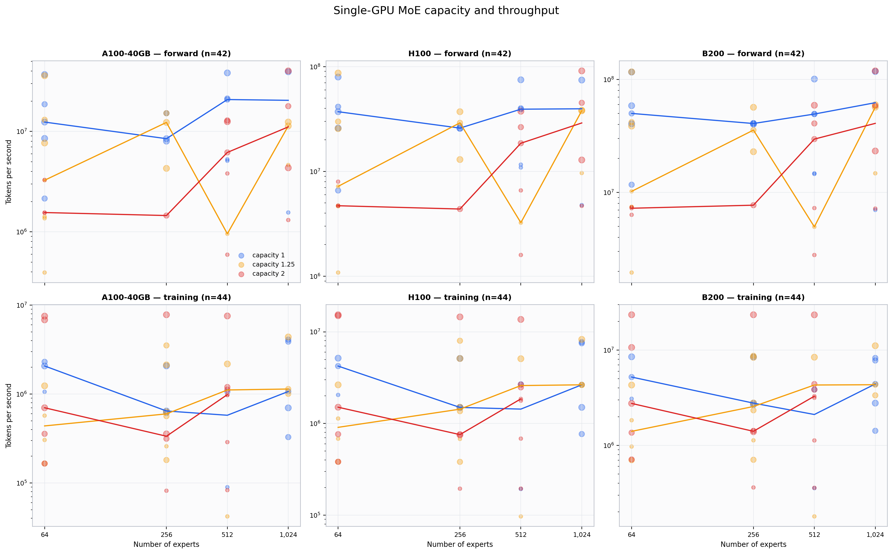
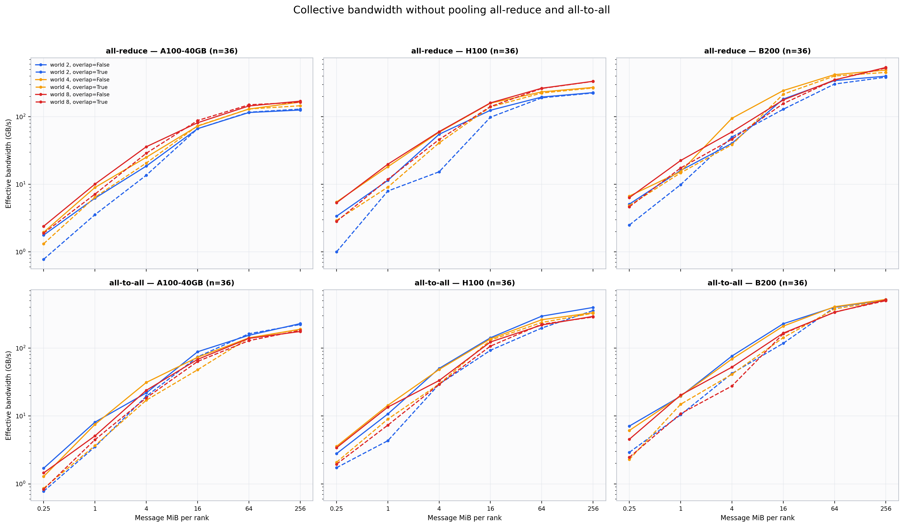
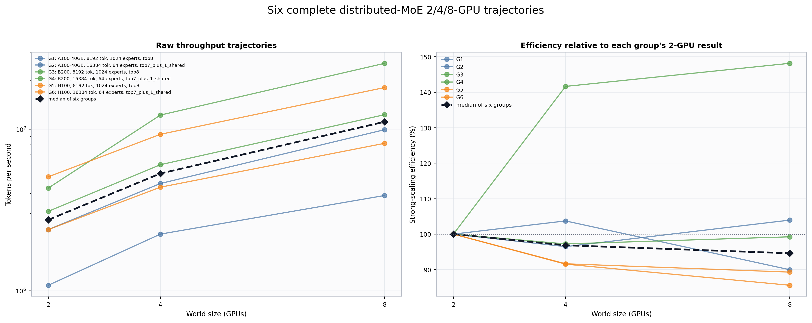
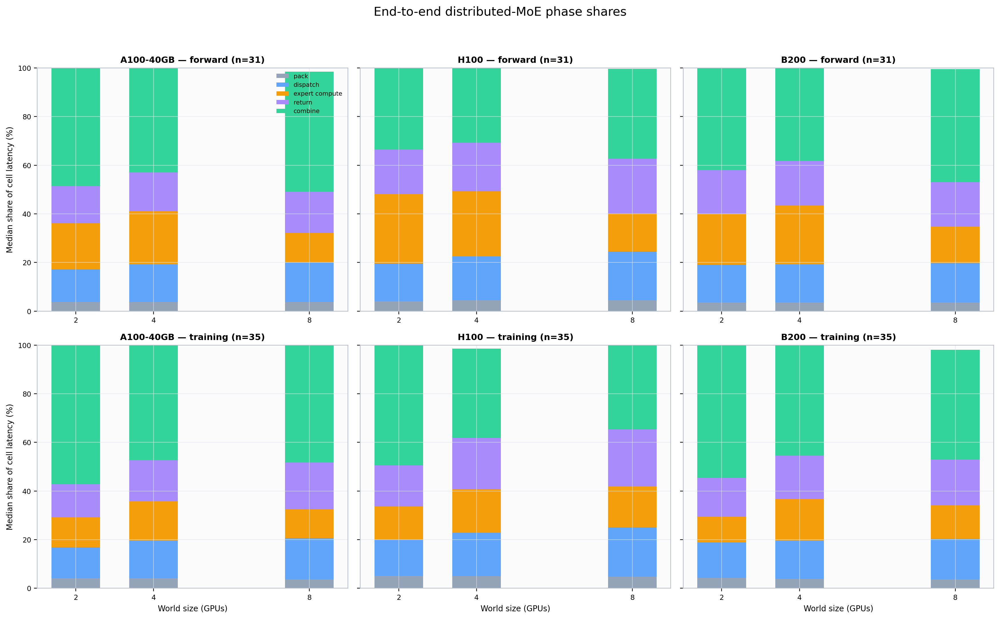

# Successful-Run EDA: Attention and MoE Hardware Measurements

This report explains the direct timing evidence in
`20260717_120116_swa-moe-research-v2`. Its population is only measured
result rows whose status is `succeeded`: 3,670 replicate
runs. Analytical model schedules are outside this population.

## Measurement hierarchy

| Level | Count | What it means |
| --- | ---: | --- |
| Successful replicate runs | 3,670 | Independently dispatched, fresh-container measurements. |
| Distinct parameter cells | 1,842 | Unique controlled parameter combinations after replicates are collapsed. |
| Cells with two successful replicates | 1,828 | Both intended fresh-container replicate medians are available. |
| Cells with one successful replicate | 14 | One measured replicate contributes the cell aggregate. |
| Attention cells | 1,170 | Attention parameter cells across GPU, mode, shape, sparsity, block, and runtime profile. |
| Single-GPU MoE cells | 258 | One-GPU routed-expert workloads. |
| Distributed-MoE cells | 414 | Collective microbenchmarks plus end-to-end expert-parallel workloads. |
| Collective-microbenchmark cells | 216 | Direct all-reduce or all-to-all measurements. |
| End-to-end distributed cells | 198 | Full route, communication, expert compute, return, and combine measurements. |

The cell buckets sum to 1,170 +
258 +
414 = 1,842.
The distributed bucket separately sums to
216 +
198 =
414.

## Experiment design

A **cell** is one controlled parameter combination. The campaign intended two
independent fresh-container replicates per cell. Each successful replicate
performed 3 warmup iterations followed by
10 timed iterations; the replicate median is
the primary steady-state latency summary. The design used deterministic
coverage-oriented selection under a GPU-hour budget, so it did not execute every
member of the possible Cartesian product. Comparisons in this report therefore
use exact matches or clearly named successful subsets rather than filling
unmeasured combinations.

## Input and output buckets

### Attention inputs

| Input axis | Observed successful values | Meaning |
| --- | --- | --- |
| GPU | A100-40GB, H100, B200 | Accelerator family. |
| Mode | forward, training | Forward inference or training forward plus backward. |
| Sequence length | 1,024, 2,048, 4,096, 8,192, 16,384 | Tokens in each attention sequence. |
| Window / density | windows 128, 256, 512, 1,024, 2,048, 4,096, 8,192 plus global; density 0.0078125–1 | Window is the causal key span; density is min(window, sequence)/sequence, with global set to 1. |
| Coupled head geometry | 16×256, 32×128, 64×64 | Head count and head dimension vary together; observed model width is 4,096. |
| Batch | 1, 2, 4 | Sequences per operation. |
| Dtype | bfloat16, float16 | Input and compute precision. |
| Block size | 64, 128, 256; not applicable to global | FlexAttention sparse mask tile size. |
| Runtime profile | baseline; disable caches; reduce overhead; max autotune without CUDA graphs | Baseline default behavior or one of three alternate compiler settings. |

Runtime profiles mean:

- **Baseline:** the workload's default measured execution, without an alternate compiler profile.
- **Disable caches:** default compilation with `TORCHINDUCTOR_FORCE_DISABLE_CACHES=1`, which bypasses TorchInductor caches.
- **Reduce overhead:** `torch.compile`'s `reduce-overhead` mode, intended to reduce framework overhead and use CUDA graphs where applicable.
- **Max autotune without CUDA graphs:** `torch.compile`'s `max-autotune-no-cudagraphs` mode, which searches more kernel choices while excluding CUDA graphs.

### Single-GPU MoE inputs

| Input axis | Observed successful values | Meaning |
| --- | --- | --- |
| GPU / mode | A100-40GB, H100, B200; forward, training | Single-GPU forward or training execution. |
| Tokens | 2,048, 8,192, 16,384 | Tokens entering the MoE layer. |
| Experts | 64, 256, 512, 1,024 | Total configured experts. |
| Routing variant | top1, top2, top4, top7_plus_1_shared, top8 | Routed experts per token, including the seven-routed plus one-shared variant. |
| Routing skew | balanced, hot80_20, zipf1.0 | Balanced, Zipf, or hot-80/20 token-to-expert demand. |
| Model dimensions | 2,048×5,504, 4,096×14,336, 8,192×28,672 | Hidden and intermediate widths vary as coupled pairs. |
| Capacity factor | 1, 1.25, 2 | Multiplier controlling per-expert route capacity. |

### Distributed inputs

| Input axis | Observed successful values | Meaning |
| --- | --- | --- |
| GPU / world size | A100-40GB, H100, B200; world sizes 2, 4, 8 | GPU family and number of participating ranks. |
| Collective type | all-reduce and all-to-all microbenchmarks; expert all-to-all end-to-end | Communication primitive; collective types are analyzed separately. |
| Message size | 262,144, 1,048,576, 4,194,304, 16,777,216, 67,108,864, 268,435,456 bytes/rank | Payload contributed by each rank in a collective cell. |
| Overlap | synchronous and asynchronous | Whether a small matrix multiply is issued while the collective runs. |
| End-to-end MoE workload | tokens 2,048, 8,192, 16,384; experts 64, 256, 512, 1,024; both modes | End-to-end cells also vary routing variant/skew, coupled dimensions, and capacity factor as in the single-GPU bucket. |

### Measured outputs

| Measured output | Unit / representation | Meaning |
| --- | --- | --- |
| Latency and tails | ms; p05, median, p95; p95/median | Steady-state operation time and within-run tail inflation. |
| Throughput | tokens/s | Delivered token processing rate for MoE workloads. |
| Memory | allocated and reserved bytes | Peak CUDA allocator memory during timed work. |
| Compute efficiency | useful TFLOP/s and % of peak | Algorithmic work rate relative to the configured hardware peak. |
| Bandwidth | effective GB/s | Collective-specific effective bandwidth derived from payload, ranks, and latency. |
| Capacity behavior | route/drop counts and occupancy skew | How expert capacity interacts with routed demand. |
| Distributed phase shares | % of latency | Pack, dispatch, expert compute, return, and combine contributions. |

## Replicate agreement and attention distributions

Across the 1,828 cells with two medians, the median absolute
replicate difference is 3.60% and
the 90th percentile is 25.15%.

### Bland–Altman replicate agreement

| Reading key | Definition |
| --- | --- |
| Source subset | Successful cells with exactly two fresh-container replicate medians (1,828 cells). |
| Unit of analysis | One distinct parameter cell represented by its two replicate medians. |
| X | Arithmetic mean of replicate 1 and replicate 2 median latency, in milliseconds. |
| Y | Signed replicate difference: 100 × (replicate 2 − replicate 1) / their mean. |
| Encodings | Color is GPU; marker shape is suite; dashed horizontal lines mark ±10% disagreement. |
| Meaning of n | n is the number of distinct two-replicate cells, not timed iterations. |

**Plain-language interpretation.** Points near zero reproduced closely; the sign only records replicate order and is not a treatment effect.

**Limit.** Two replicates reveal disagreement but provide limited information about the full run-to-run distribution.

[SVG](swa_global_attention_eda/figures/01_replicate_agreement.svg) · [plotted data](swa_global_attention_eda/data/01_replicate_agreement.csv) · [metadata](swa_global_attention_eda/metadata/01_replicate_agreement.json)

### Attention latency and tail ECDFs

| Reading key | Definition |
| --- | --- |
| Source subset | All 1,170 successful attention cells across the four observed runtime profiles. |
| Unit of analysis | One distinct successful attention parameter cell. |
| X | Left: cell median latency in ms. Right: the cell's p95 latency divided by its median latency. |
| Y | Percentage of cells in that GPU/mode curve whose X value is at or below the plotted value. |
| Encodings | Color is GPU and line style is forward versus training; each GPU/mode combination has one curve. |
| Meaning of n | n in each legend label is distinct cells in that curve, not sequence length or iteration count. |

**Plain-language interpretation.** A curve farther left reaches the same cumulative percentage at a smaller value, within its sampled workload mix.

**Limit.** Curves contain different sampled configurations and are descriptive distributions, not controlled GPU or attention-type comparisons.

[SVG](swa_global_attention_eda/figures/02_attention_ecdf.svg) · [plotted data](swa_global_attention_eda/data/02_attention_ecdf.csv) · [metadata](swa_global_attention_eda/metadata/02_attention_ecdf.json)

## Controlled attention-system responses

### Matched block-size response

| Reading key | Definition |
| --- | --- |
| Source subset | The 42 successful windowed-attention pairs matched on every controlled axis except block size. |
| Unit of analysis | One exact two-block parameter match. |
| X | GPU family. |
| Y | Numerator-block median latency divided by denominator-block median latency. |
| Encodings | Panel identifies the block-size ratio; points are matches; black bars are within-GPU medians. |
| Meaning of n | n is the number of exact block-size pairs in that panel (30 and 12; 42 total). |

**Plain-language interpretation.** Below 1 means the numerator block is faster; above 1 means the denominator block is faster.

**Limit.** The two panels cover different workloads and no inference should chain their ratios into an unobserved 64-versus-128 comparison.

[SVG](swa_global_attention_eda/figures/03_block_size_response.svg) · [plotted data](swa_global_attention_eda/data/03_block_size_response.csv) · [metadata](swa_global_attention_eda/metadata/03_block_size_response.json)

### Memory versus GPU time

| Reading key | Definition |
| --- | --- |
| Source subset | All 283 successful baseline attention cells with measured peak reserved memory. |
| Unit of analysis | One distinct baseline attention parameter cell. |
| X | Peak CUDA reserved memory in GiB, on a log scale. |
| Y | Cell median latency divided by batch size × sequence length, in ms per batch-token position, on a log scale. |
| Encodings | Color is attention density; point area increases with sequence length; black outlines and connecting lines mark Pareto cells within one GPU/mode facet. |
| Meaning of n | n in each facet is the number of distinct baseline attention cells on that GPU and mode; 283 cells total. |

**Plain-language interpretation.** Lower-left cells use less reserved memory and less normalized GPU time; outlined points are not dominated on both axes within their facet.

**Limit.** The normalization does not make training and forward equivalent, so Pareto dominance is never pooled across modes or GPUs.

[SVG](swa_global_attention_eda/figures/04_memory_vs_gpu_time.svg) · [plotted data](swa_global_attention_eda/data/04_memory_vs_gpu_time.csv) · [metadata](swa_global_attention_eda/metadata/04_memory_vs_gpu_time.json)

### Runtime-profile effects

| Reading key | Definition |
| --- | --- |
| Source subset | All 849 successful profile-versus-baseline attention matches: 283 for each alternate compiler profile. |
| Unit of analysis | One controlled workload matched between an alternate runtime profile and baseline. |
| X | Compiler profile: cache-disabled default compilation, reduce-overhead, or max-autotune without CUDA graphs. |
| Y | 100 × (profile median latency − baseline median latency) / baseline median latency. |
| Encodings | Facet is GPU; each point is a match; boxes show quartiles and the within-profile median. |
| Meaning of n | n is matched profile/baseline effects in that GPU facet; 849 effects total. |

**Plain-language interpretation.** Negative values mean the alternate profile was faster than baseline; positive values mean it was slower.

**Limit.** Effects remain workload-specific even after matching; boxplot summaries do not establish one universal compiler winner.

[SVG](swa_global_attention_eda/figures/05_runtime_profile_effects.svg) · [plotted data](swa_global_attention_eda/data/05_runtime_profile_effects.csv) · [metadata](swa_global_attention_eda/metadata/05_runtime_profile_effects.json)

The complete-triplet subset has median direct ratios of
2.80 for A100/H100 and
1.20 for H100/B200. These medians
summarize workload-specific ratios; the points show their dispersion.

### Hardware portability

| Reading key | Definition |
| --- | --- |
| Source subset | Only the 69 successful baseline attention workloads measured on A100-40GB, H100, and B200 with every non-hardware axis identical. |
| Unit of analysis | One complete three-GPU workload triplet. |
| X | A100 median latency divided by H100 median latency. |
| Y | H100 median latency divided by B200 median latency. |
| Encodings | Color is attention density; marker is mode; point area increases with sequence length; reference lines are ratio 1. Axes use logarithmic spacing but retain direct ratio labels. |
| Meaning of n | n is complete workload triplets, so each point summarizes three successful cells. |

**Plain-language interpretation.** A ratio above 1 means the newer GPU on that axis is faster for the same workload.

**Limit.** The 69 complete triplets are the supported portability subset; no value is imputed for incomplete workload triples.

[SVG](swa_global_attention_eda/figures/06_hardware_portability.svg) · [plotted data](swa_global_attention_eda/data/06_hardware_portability.csv) · [metadata](swa_global_attention_eda/metadata/06_hardware_portability.json)

## MoE throughput, communication, and scaling

### Single-GPU MoE capacity and throughput

| Reading key | Definition |
| --- | --- |
| Source subset | All 258 successful single-GPU MoE cells. |
| Unit of analysis | One distinct single-GPU MoE parameter cell. |
| X | Configured number of experts, on a base-2 log scale. |
| Y | Measured tokens per second, on a log scale. |
| Encodings | Facet is GPU and execution mode; color is capacity factor; point area increases with token count; lines connect within-facet medians. |
| Meaning of n | n is distinct single-GPU MoE cells in that GPU/mode facet; 258 cells total. |

**Plain-language interpretation.** Within a facet, vertical separation shows how throughput varies over sampled expert counts and capacity factors without mixing training with forward runs.

**Limit.** Routing variant, routing skew, token count, and model dimensions still vary within each facet, so lines are descriptive medians rather than isolated causal effects.

[SVG](swa_global_attention_eda/figures/07_single_moe_capacity_throughput.svg) · [plotted data](swa_global_attention_eda/data/07_single_moe_capacity_throughput.csv) · [metadata](swa_global_attention_eda/metadata/07_single_moe_capacity_throughput.json)

### Collective bandwidth

| Reading key | Definition |
| --- | --- |
| Source subset | All 216 successful collective microbenchmark cells: 108 all-reduce and 108 all-to-all. |
| Unit of analysis | One distinct collective × GPU × world-size × message-size × overlap cell. |
| X | Payload bytes contributed by each rank, displayed as MiB per rank on a base-2 log scale. |
| Y | Effective collective bandwidth in decimal GB/s, computed with collective-specific traffic factors. |
| Encodings | Rows separate collective type; columns separate GPU; color is world size; dashed lines enable asynchronous overlap. |
| Meaning of n | n is distinct collective cells in a facet; all 216 cells are represented and incompatible collectives are never pooled. |

**Plain-language interpretation.** Rising curves show message-size amortization; the gap between solid and dashed curves shows the measured effect of asynchronous overlap.

**Limit.** Effective bandwidth is an algorithm-aware derived rate, not a direct physical-link counter.

[SVG](swa_global_attention_eda/figures/08_collective_bandwidth.svg) · [plotted data](swa_global_attention_eda/data/08_collective_bandwidth.csv) · [metadata](swa_global_attention_eda/metadata/08_collective_bandwidth.json)

### Distributed-MoE scaling

| Reading key | Definition |
| --- | --- |
| Source subset | The six end-to-end workload groups with successful measurements at world sizes 2, 4, and 8 (18 cells). |
| Unit of analysis | One exact workload trajectory; each trajectory contains three world-size cells. |
| X | World size: number of GPUs participating in expert parallelism. |
| Y | Left: measured tokens/s. Right: 100 × (throughput at p / throughput at 2) / (p / 2). |
| Encodings | Each colored line is one complete workload group; color is GPU; the black dashed line is the median across the six groups. |
| Meaning of n | n is six complete workload groups, not all 198 end-to-end cells; each median contains six group values. |

**Plain-language interpretation.** Throughput shows delivered work; 100% efficiency means throughput grew in direct proportion to GPU count relative to the 2-GPU baseline.

**Limit.** Only exact workloads with all three world sizes enter this figure; it does not pool partially supported workload identities.

[SVG](swa_global_attention_eda/figures/09_distributed_scaling.svg) · [plotted data](swa_global_attention_eda/data/09_distributed_scaling.csv) · [metadata](swa_global_attention_eda/metadata/09_distributed_scaling.json)

### Distributed-MoE phase shares

| Reading key | Definition |
| --- | --- |
| Source subset | All 198 successful end-to-end distributed-MoE cells, summarized separately from the collective microbenchmarks. |
| Unit of analysis | One cell-phase share; each of 198 cells contributes five shares that sum to approximately 100%. |
| X | World size: 2, 4, or 8 GPUs. |
| Y | Within each GPU/mode/world-size group, the median percentage of cell latency assigned to each phase. |
| Encodings | Facet is GPU and mode; stacked color is pack, dispatch, expert compute, return, or combine. |
| Meaning of n | n in each facet is distinct end-to-end cells before phase expansion; 198 cells total. |

**Plain-language interpretation.** Pack forms routed buffers; dispatch sends them to expert ranks; expert compute runs expert work; return sends outputs back; combine accumulates outputs into token order.

**Limit.** Stacks summarize a heterogeneous successful-cell sample; medians of individual phase shares need not total exactly 100 before plotting.

[SVG](swa_global_attention_eda/figures/10_distributed_phase_shares.svg) · [plotted data](swa_global_attention_eda/data/10_distributed_phase_shares.csv) · [metadata](swa_global_attention_eda/metadata/10_distributed_phase_shares.json)

## Reproducibility package

- Source run: [`../runs/swa_moe_hardware/20260717_120116_swa-moe-research-v2/`](../runs/swa_moe_hardware/20260717_120116_swa-moe-research-v2/)
- Figure index: [CSV](swa_global_attention_eda/figure_index.csv) · [JSON](swa_global_attention_eda/figure_index.json)
- Machine-readable successful-bucket statistics: [statistics.json](swa_global_attention_eda/statistics.json)
- Generator: [`experiments/swa_moe_hardware/eda_report.py`](../experiments/swa_moe_hardware/eda_report.py)

Every retained figure has a PNG, SVG, exact plotted CSV, and metadata JSON.
The figure index repeats the source subset, analysis unit, axes, encodings,
meaning of `n`, interpretation, and limitation used in this report.
