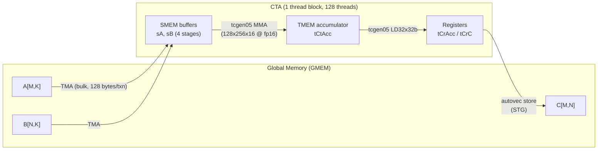
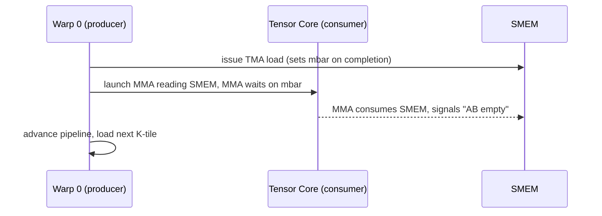
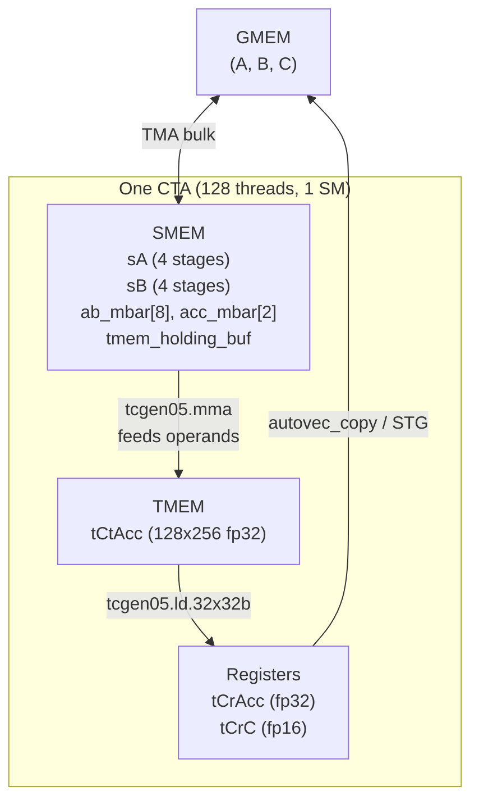
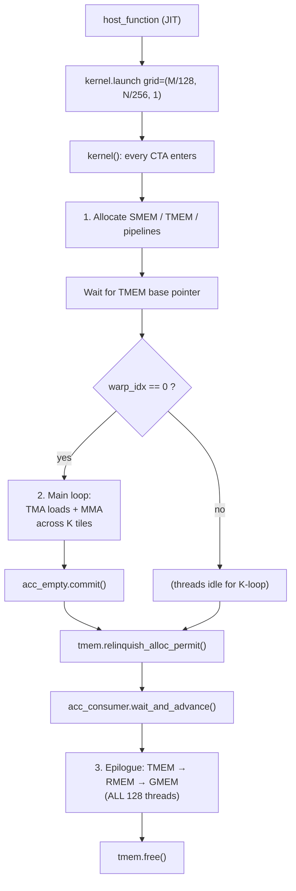
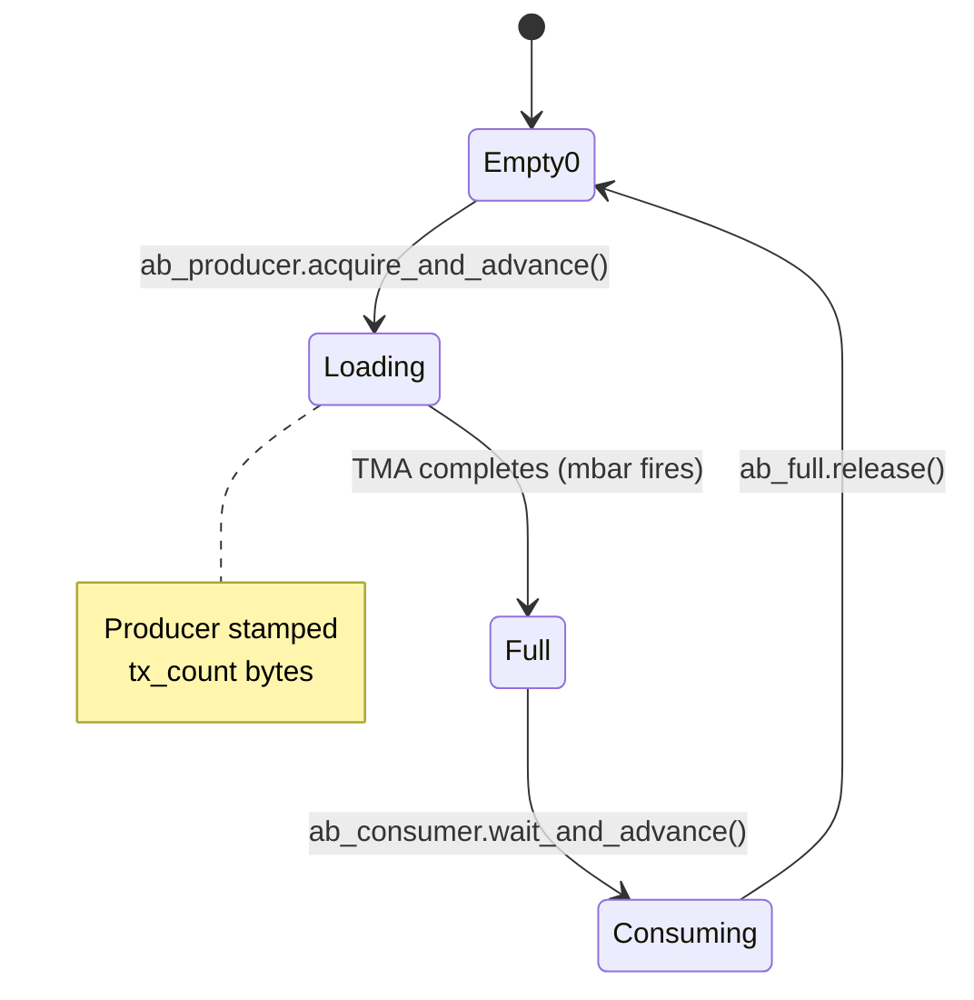
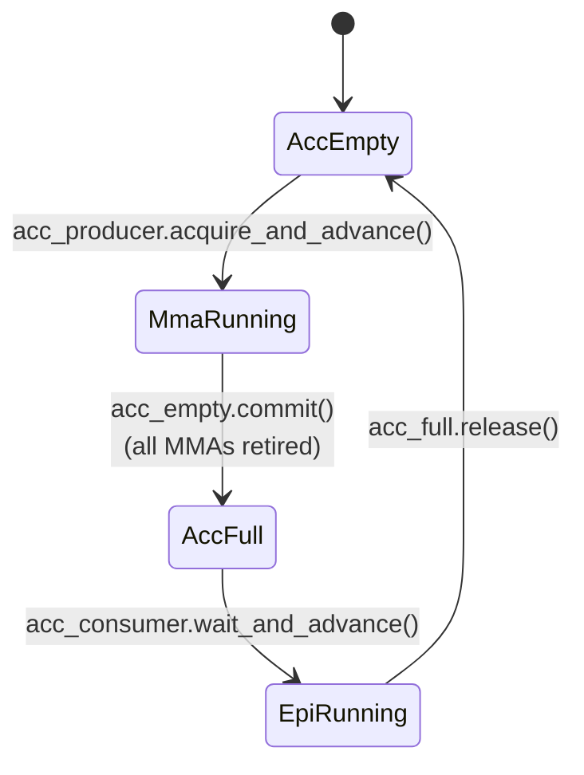
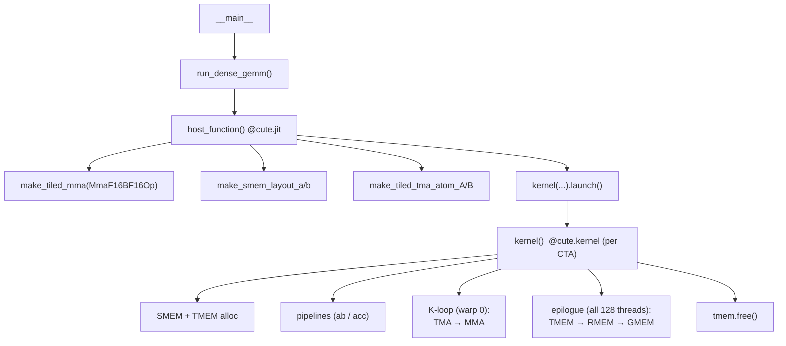

# Deep Dive: `fp16_gemm_0.py` — Blackwell FP16 GEMM in CuTeDSL

> Target file: `attention_in_code/examples/python/CuTeDSL/blackwell/tutorial_gemm/fp16_gemm_0.py`
>
> Goal of this doc: make every line understandable to someone who has **not** written CuTeDSL before. We explain **what** each line does, **how** it works at the hardware/compiler level, and **why** the author wrote it that way. Diagrams are written in Mermaid — they render on GitHub and in most IDE markdown previewers.

---

## Table of Contents
1. [Mental model: what this kernel actually is](#1-mental-model)
2. [Hardware crash-course (Blackwell / SM100)](#2-hardware-crash-course)
3. [CuTeDSL crash-course (Layouts, Tiles, Atoms, TiledMMA)](#3-cutedsl-crash-course)
4. [Memory hierarchy used by this kernel](#4-memory-hierarchy)
5. [Top-level control flow](#5-top-level-control-flow)
6. [Pipeline state machines](#6-pipeline-state-machines)
7. [Line-by-line walkthrough](#7-line-by-line-walkthrough)
8. [Recurring patterns glossary](#8-recurring-patterns-glossary)

---

## 1. Mental model

We are computing `C = A · Bᵀ` where `A` is `MxK`, `B` is `NxK` (K-major, i.e. rows are contiguous), `C` is `MxN`. On an 8192×8192×8192 problem:

- The kernel tiles the output `C` into blocks of shape `128 × 256` (`bM × bN`).
- Each Cooperative Thread Array (CTA — i.e. one thread block) owns **one** `128×256` tile of `C`.
- That CTA walks along K in chunks of `64` (`bK`), loading `A` tiles `(128×64)` and `B` tiles `(256×64)` from global memory into shared memory (SMEM) using **TMA**, then runs the tile through a **tensor-core MMA** whose result accumulates into **TMEM** (a new Blackwell memory space). At the end, one "epilogue" copies the accumulator out of TMEM → registers → global memory.
- There are two producer/consumer pipelines running in parallel:
  - **AB pipeline** (4 stages): TMA-load producer → MMA consumer
  - **ACC pipeline** (1 stage): MMA producer → epilogue consumer



### Role split inside the CTA
- **Warp 0** does *everything* in the K-loop: issues TMA loads, waits on the AB pipeline, and launches MMA instructions. The MMA instructions themselves execute asynchronously on the tensor core.
- **All 128 threads** participate in the epilogue: they cooperatively copy TMEM → RMEM → GMEM.

This is a very simple form of **warp specialization** — a pattern you'll see everywhere in Hopper/Blackwell kernels.

---

## 2. Hardware crash-course

### 2.1 What's new in Blackwell (SM100) vs Hopper (SM90)

| Concept | Hopper (SM90) | Blackwell (SM100) |
|---|---|---|
| Tensor-core instruction family | `wgmma` (warp-group MMA) | `tcgen05` (5th-gen) |
| Accumulator lives in | Registers (warp-group distributed) | **TMEM** (a separate on-chip memory space) |
| Loads fed directly to MMA from | SMEM | SMEM *or* TMEM |
| Clusters (multi-CTA MMA) | Optional | First-class (`CtaGroup.ONE/TWO`) — here we use `ONE` |

### 2.2 TMA (Tensor Memory Accelerator)

- A DMA-engine-like unit that copies multi-dimensional tiles between GMEM and SMEM using a single instruction (`cp.async.bulk.tensor`).
- Each TMA issue is described by a **TMA descriptor** (a 128-byte blob) prepared on the host.
- TMA completions signal **mbarriers** (memory barriers living in SMEM). The kernel waits on these barriers instead of syncing threads.

### 2.3 TMEM (Tensor Memory)

- A dedicated on-chip memory space used by `tcgen05` for accumulators. Treat it as "SRAM for fp32 accumulators" that the tensor core can read/write at full rate.
- Allocated in **columns** (each column is 128 elements tall). We request `512` columns here.
- Allocation is explicit: one warp calls an allocator, stashes the base pointer in SMEM, then the whole CTA reads that pointer.

### 2.4 mbarriers, pipelines, UMMA async

- A **memory barrier** in SMEM is a 64-bit object. Threads can:
  - *arrive* (decrement an arrival count)
  - *wait* until phase flips
- TMA and MMA instructions can set up mbarriers to fire upon completion → producer/consumer synchronization **without** threads spinning.
- `PipelineTmaUmma` wraps this for TMA→MMA hand-off. `PipelineUmmaAsync` wraps MMA→downstream hand-off.



---

## 3. CuTeDSL crash-course

CuTeDSL is a Python-embedded DSL that compiles to CUTLASS + CUDA. A few ideas you need before reading code:

### 3.1 `Layout`
A layout is `(Shape, Stride)` describing how a logical index maps to a linear offset. Example: a `(4,8)` tensor with stride `(8,1)` is row-major.

### 3.2 `Tensor`
A pointer + layout. It lives somewhere (GMEM/SMEM/RMEM/TMEM) determined by how it was created.

### 3.3 `local_tile(T, tiler, coord, proj=…)`
Given a big tensor `T`, a tile shape, and a block coordinate, returns the *local view* for that block. The `proj` mask selects which modes (M, N, K, …) this operand participates in. For `A`, `proj=(1, None, 1)` means "keep M and K dimensions, skip N" — the M-dimension selects the tile in M, N dimension is masked, K dimension enumerates all K-tiles.

### 3.4 `TiledMMA` and `thr_mma`
`tiled_mma` abstracts one tensor-core instruction (e.g. `128×256×16 fp16`) tiled to cover the `128×256×64` CTA tile. `thr_mma = tiled_mma.get_slice(0)` gives the partition for a single "MMA thread" (with `tcgen05`, one thread owns the whole MMA — very different from Hopper's warp-group model).

- `thr_mma.partition_A(gA)` → the A-shape view that aligns to this MMA.
- `make_fragment_A(sA)` → a **fragment** descriptor describing how MMA reads its A operand from `sA`. Fragments on Blackwell are descriptor tensors, not register-residents like on Hopper.
- `make_fragment_C(shape)` → the placeholder accumulator tensor living in TMEM.

### 3.5 `cute.copy(atom, src, dst, ...)`
Universal "issue a copy" call. The atom knows *how* (TMA bulk / STG / `tcgen05.ld.32x32b` / etc.). The source/destination tensors encode *what* to move.

### 3.6 `cute.gemm(tiled_mma, D, A, B, C)`
Issues tensor-core instruction(s). `D = A*B + C` per the MMA's semantics. Here `D` and `C` are the same TMEM tensor → accumulate in place.

---

## 4. Memory hierarchy



Why TMEM? Because keeping the accumulator off of registers frees up register file space and lets the tensor core run at a higher occupancy / issue rate.

---

## 5. Top-level control flow



---

## 6. Pipeline state machines

### 6.1 AB pipeline (4-stage, TMA → MMA)

Each stage is one `sA`/`sB` SMEM buffer. The producer is warp-0 issuing TMA, the consumer is the tensor core that reads those SMEM buffers.



Four of these states run in a rotating ring (stages 0–3). `prefetch_stages=ab_stages-2 = 2` means at steady state, 2 stages are "in flight" ahead of the MMA.

### 6.2 ACC pipeline (1-stage, MMA → epilogue)



Only one stage because the accumulator is huge (`128×256 × fp32 = 128 KiB` of TMEM). We pay for it once per CTA.

### 6.3 Timing picture (steady state)

```mermaid
gantt
    title AB pipeline steady state (4 stages)
    dateFormat  X
    axisFormat  %s
    section TMA (warp0)
    load k0       :done, 0, 1
    load k1       :done, 1, 2
    load k2       :done, 2, 3
    load k3       :done, 3, 4
    load k4       :active, 4, 5
    section MMA (tensor core)
    mma k0        :crit, 2, 3
    mma k1        :crit, 3, 4
    mma k2        :crit, 4, 5
```



TMA runs ~2 K-tiles ahead of MMA — that's the `prefetch_stages=2`.

---

## 7. Line-by-line walkthrough

The file has four logical parts:

1. Imports and constants (lines 1–49)
2. `SharedStorage` struct (lines 51–55)
3. `@cute.kernel` function (lines 58–270) — runs on each CTA
4. `@cute.jit` `host_function` (lines 273–344) — prepares TMA atoms and launches
5. `run_dense_gemm` + `__main__` (lines 347–441) — Python driver

### 7.1 Imports and constants (lines 1–49)

```python
import argparse
from typing import Tuple
import cutlass
import cutlass.cute as cute
import cutlass.utils as utils
import cutlass.pipeline as pipeline
from cutlass.cute.nvgpu import cpasync, tcgen05
import cutlass.utils.blackwell_helpers as sm100_utils
from cutlass.cute.runtime import from_dlpack
```

- **`cutlass`** — Python types like `Float16`, `Float32`, `Int32`.
- **`cute`** — core DSL: `Tensor`, `Layout`, `copy`, `gemm`, `local_tile`, ...
- **`cutlass.pipeline`** — producer/consumer pipeline helpers (`PipelineTmaUmma`, `CooperativeGroup`, `NamedBarrier`).
- **`cpasync`** — cp-async and TMA atoms.
- **`tcgen05`** — Blackwell tensor core atoms and enums (`MmaF16BF16Op`, `Ld32x32bOp`, `CtaGroup.ONE`, `OperandSource.SMEM`, `OperandMajorMode.K`, `Field.ACCUMULATE`).
- **`sm100_utils`** — convenience: `make_smem_layout_a/b` builds correctly-swizzled SMEM layouts.
- **`from_dlpack`** — turns a PyTorch tensor into a `cute.Tensor` without copying.

```python
io_dtype = cutlass.Float16
acc_dtype = cutlass.Float32
mma_inst_shape_mnk = (128, 256, 16)  # one tcgen05 MMA instruction shape
mma_tiler_mnk      = (128, 256, 64)  # the CTA tile; MMA repeats 64/16 = 4 times in K
threads_per_cta    = 128
ab_stages = 4
acc_stage = 1
```

- `mma_inst_shape_mnk` — the *hardware* shape of a single `tcgen05` MMA instruction. 128x256x16 means: one instruction consumes A of shape `128×16` and B of shape `256×16` and updates accumulator `128×256`.
- `mma_tiler_mnk` — the CTA tile. `K=64` means `4` MMA instructions per K-iteration (64/16). These are `num_k_blocks` later.
- `ab_stages = 4` — 4 SMEM buffers for A/B → 4-stage ring buffer → depth of software pipeline.
- `acc_stage = 1` — only one accumulator buffer in TMEM.

---

### 7.2 `SharedStorage` (lines 51–55)

```python
@cute.struct
class SharedStorage:
    ab_mbar_ptr: cute.struct.MemRange[cutlass.Int64, ab_stages * 2]
    acc_mbar_ptr: cute.struct.MemRange[cutlass.Int64, acc_stage * 2]
    tmem_holding_buf: cutlass.Int32
```

**What**: the layout of the SMEM region used for synchronization primitives.

**How**:
- `@cute.struct` produces a layout-described struct. The `SmemAllocator` later uses this to reserve and align SMEM at kernel entry.
- Each pipeline needs **2 mbarriers per stage** — one "empty→full" and one "full→empty" (producer-acquire / consumer-release). Hence `ab_stages*2` and `acc_stage*2`.
- `tmem_holding_buf` is a scratch `Int32` in SMEM used to pass the TMEM base pointer from warp-0 (who allocates) to the rest of the CTA.

**Why this struct-first pattern?** The compiler needs a statically known SMEM layout. Declaring it once as a struct makes sizes, alignments, and pointers explicit and type-safe.

> The `sA`/`sB` SMEM tensors are not in this struct — they're allocated separately by `smem.allocate_tensor(...)` later because they use **swizzled composed layouts** (line 287 onwards).

---

### 7.3 Kernel decorator (line 58)

```python
@cute.kernel
def kernel(tiled_mma, tma_atom_a, mA_mkl, tma_atom_b, mB_nkl, mC_mnl, a_smem_layout, b_smem_layout):
```

**What**: marks this function as the device-side kernel. The JIT lowers it to PTX.

**Parameters**:
- `tiled_mma` — the tensor-core op (shape + dtype + modes).
- `tma_atom_a/b` — TMA copy atoms (descriptor + pattern).
- `mA_mkl` / `mB_nkl` / `mC_mnl` — GMEM tensors with shapes `(M,K,L)`, `(N,K,L)`, `(M,N,L)`. `L` is the batch dim — here always 1.
- `a_smem_layout`, `b_smem_layout` — **composed** layouts that include swizzling so SMEM bank conflicts are avoided when MMA reads operands.

---

### 7.4 Thread / block coordinates (lines 70–74)

```python
tidx, _, _ = cute.arch.thread_idx()    # thread id in block (0..127)
warp_idx = cute.arch.warp_idx()         # 0..3
warp_idx = cute.arch.make_warp_uniform(warp_idx)
bidx, bidy, _ = cute.arch.block_idx()   # CTA coords in grid
mma_coord_mnk = (bidx, bidy, None)
```

- `make_warp_uniform` tells the compiler: this value is the same across a warp, so use a scalar register and skip per-lane broadcasts. Micro-optimization but important.
- `mma_coord_mnk` — this CTA's output tile coordinate. `None` in K means "all K tiles" (we'll loop over them).

---

### 7.5 SMEM allocation (lines 81–94)

```python
smem = cutlass.utils.SmemAllocator()
storage = smem.allocate(SharedStorage)
sA = smem.allocate_tensor(
    element_type=io_dtype,
    layout=a_smem_layout.outer,
    byte_alignment=128,
    swizzle=a_smem_layout.inner,
)
sB = smem.allocate_tensor(..., swizzle=b_smem_layout.inner)
```

**What**: cuts SMEM into three regions: the barrier/scratch struct, the A staging buffer, the B staging buffer.

**How**: `SmemAllocator` is a bump allocator over the kernel's dynamic SMEM. Each `allocate*` call returns a typed pointer/tensor and advances the cursor. `byte_alignment=128` ensures TMA's 128-byte alignment requirement.

**Why the split layout `outer` / `inner`?** `a_smem_layout` is a `ComposedLayout`:
- `outer` = the plain (M, K, STAGE) layout — shape and strides.
- `inner` = a **swizzle** functor that XORs some address bits so consecutive threads hit different SMEM banks. The allocator needs both.

---

### 7.6 TMEM allocation (lines 97–106)

```python
tmem_alloc_barrier = pipeline.NamedBarrier(barrier_id=1, num_threads=threads_per_cta)
tmem = utils.TmemAllocator(
    storage.tmem_holding_buf.ptr,
    barrier_for_retrieve=tmem_alloc_barrier,
)
num_tmem_cols = 512
tmem.allocate(num_tmem_cols)
```

**What**: reserves 512 columns of TMEM for the accumulator.

**How**:
1. Only **warp 0** issues `tmem.allocate(...)` internally. It writes the returned base pointer to the SMEM `tmem_holding_buf`.
2. A **named barrier** (hardware barrier indexed by id 1) is used so all 128 threads wait until warp-0 finishes allocating *and* publishes the pointer.
3. Later, `tmem.retrieve_ptr(...)` reads that pointer out of SMEM.

**Why a separate barrier id (1)?** `bar.sync 0` is used implicitly elsewhere (`__syncthreads`). Using id 1 keeps the TMEM handshake isolated from other sync points.

---

### 7.7 TMA descriptor prefetch (lines 109–111)

```python
if warp_idx == 0:
    cpasync.prefetch_descriptor(tma_atom_a)
    cpasync.prefetch_descriptor(tma_atom_b)
```

**What**: warms up the descriptor cache by issuing a bulk-tensor-prefetch for the two descriptors.

**Why**: the first TMA issuance has to read the 128-byte descriptor from constant memory. Prefetching it in parallel with the rest of the setup hides a few hundred cycles of latency. No synchronization follows — the TMA-issue instruction itself will wait if the descriptor isn't yet resident.

---

### 7.8 Pipeline construction (lines 114–132)

```python
num_tma_copy_bytes = cute.size_in_bytes(io_dtype, cute.select(a_smem_layout, mode=[0,1,2])) \
                   + cute.size_in_bytes(io_dtype, cute.select(b_smem_layout, mode=[0,1,2]))
```

**What**: the total bytes TMA will write per stage (one A-tile + one B-tile).

**How**: `cute.select(layout, mode=[0,1,2])` keeps modes 0,1,2 (which are `M`, `K`, stage-inner) and drops the stage dim. `size_in_bytes` multiplies element count × dtype size. This number is stamped into the mbarrier: the barrier only fires once **exactly that many bytes** have been deposited.

```python
ab_producer, ab_consumer = pipeline.PipelineTmaUmma.create(
    num_stages=ab_stages,
    producer_group=pipeline.CooperativeGroup(pipeline.Agent.Thread),
    consumer_group=pipeline.CooperativeGroup(pipeline.Agent.Thread),
    tx_count=num_tma_copy_bytes,
    barrier_storage=storage.ab_mbar_ptr.data_ptr(),
).make_participants()
```

**What**: creates the 4-stage TMA→UMMA pipeline and returns *participant* handles: `ab_producer` (for the thread issuing TMA) and `ab_consumer` (for the thread issuing MMA).

**How**:
- Each stage has one empty-barrier and one full-barrier. `barrier_storage` is the SMEM array we reserved earlier.
- `tx_count` — bytes the TMA will commit before signaling the "full" barrier.
- `Agent.Thread` — the work unit is a single thread (warp-0 thread 0, the "one hot" MMA-issuer). Multi-threaded producers would use `Agent.Warp` or cooperative groups.

```python
acc_producer, acc_consumer = pipeline.PipelineUmmaAsync.create(
    num_stages=acc_stage,
    producer_group=pipeline.CooperativeGroup(pipeline.Agent.Thread),
    consumer_group=pipeline.CooperativeGroup(pipeline.Agent.Thread, threads_per_cta),
    barrier_storage=storage.acc_mbar_ptr.data_ptr(),
).make_participants()
```

- Producer side is again one thread (the MMA issuer), but the consumer is the **whole 128-thread CTA** (the epilogue is cooperative), hence `CooperativeGroup(Agent.Thread, 128)`.
- `PipelineUmmaAsync` is designed around the fact that `tcgen05.mma` retires asynchronously — the barrier it uses is signaled by the tensor core itself when all enqueued MMAs finish.

---

### 7.9 Partitioning tensors (lines 136–170)

This is the densest part syntactically but conceptually simple: **we take big GMEM tensors and project them down to this CTA's view for MMA and TMA.**

```python
gA = cute.local_tile(mA_mkl, mma_tiler_mnk, mma_coord_mnk, proj=(1, None, 1))  # (bM,bK,RestK)
gB = cute.local_tile(mB_nkl, mma_tiler_mnk, mma_coord_mnk, proj=(None, 1, 1))  # (bN,bK,RestK)
gC = cute.local_tile(mC_mnl, mma_tiler_mnk, mma_coord_mnk, proj=(1, 1, None))  # (bM,bN)
```

**Meaning of `proj`**: for each operand, which of the `(M,N,K)` tile modes apply?
- A is `M×K` → `proj=(1, None, 1)` → keep M, skip N, keep K (all K-tiles retained).
- B is `N×K` → `proj=(None, 1, 1)` → keep N, skip M, keep K.
- C is `M×N` → `proj=(1, 1, None)` → keep M and N, K is consumed.

After `local_tile`, `gA.shape = (128, 64, num_k_tiles)` — one M-tile wide, one K-tile deep, and a chain of K-tiles to iterate.

```python
thr_mma = tiled_mma.get_slice(0)
tCgA = thr_mma.partition_A(gA)   # (MMA, MMA_M, MMA_K)
tCgB = thr_mma.partition_B(gB)
tCgC = thr_mma.partition_C(gC)
```

`thr_mma.partition_*` re-organizes the tile so it aligns to how the tensor-core instruction wants data. `(MMA, MMA_M, MMA_K)` means:
- Mode 0 (`MMA`): the internal layout of **one** MMA instruction's operand view.
- Mode 1 (`MMA_M`): how many M-tiles fit in the CTA tile → `128/128 = 1`.
- Mode 2 (`MMA_K`): how many K-tiles fit in one iteration → `64/16 = 4` **and** the outer K-tile iterations.

```python
tCrA = tiled_mma.make_fragment_A(sA)   # A-operand *descriptor* in SMEM
tCrB = tiled_mma.make_fragment_B(sB)
acc_shape = tiled_mma.partition_shape_C(mma_tiler_mnk[:2])
tCtAcc = tiled_mma.make_fragment_C(acc_shape)   # placeholder TMEM tensor
```

**Important**: on Blackwell, fragments for SMEM-sourced MMA are **descriptor tensors**, not register tensors. They tell the MMA instruction how to walk SMEM. `tCrA` uses `sA` under the hood, not a register copy.

```python
tAsA, tAgA = cute.nvgpu.cpasync.tma_partition(
    tma_atom_a, 0, cute.make_layout(1),
    cute.group_modes(sA, 0, 3),
    cute.group_modes(tCgA, 0, 3),
)
```

**What**: derive the two *TMA-view* tensors:
- `tAsA` — the SMEM destination from TMA's viewpoint (one row of bytes per issue).
- `tAgA` — the GMEM source from TMA's viewpoint.

**How**: `group_modes(sA, 0, 3)` flattens modes `[0,1,2]` into a single "per-tile" mode, leaving the stage dim. Then `tma_partition` derives the per-issue linearization. The `0` is the multicast mask (unused → single CTA), `make_layout(1)` is a trivial cluster layout.

The result: `tAgA` and `tAsA` are indexable by `(TMA, k_tile_idx)` and `(TMA, stage_idx)` respectively.

---

### 7.10 TMEM pointer wiring (lines 174–177)

```python
tmem.wait_for_alloc()          # named-barrier sync 128 threads
tmem_ptr = tmem.retrieve_ptr(acc_dtype)
tCtAcc = cute.make_tensor(tmem_ptr, tCtAcc.layout)
```

**What**: block all 128 threads until warp-0 has published the TMEM base pointer, then rebuild `tCtAcc` so it points into real TMEM (the original `tCtAcc` from `make_fragment_C` had only a layout, not a pointer).

**Why this indirection**: TMEM is allocated at runtime by one warp, but every thread needs the same base address for the epilogue copy. Publishing via SMEM + barrier is the canonical Blackwell pattern.

---

### 7.11 Epilogue sub-tiling (lines 179–205)

```python
subtile_cnt = 4
epi_tiler = (
    (cute.size(tCtAcc, mode=[0, 0]), cute.size(tCtAcc, mode=[0, 1]) // subtile_cnt),
)
tCtAcc_epi = cute.zipped_divide(tCtAcc, epi_tiler)  # (EpiTile, NumTiles)
gC_epi     = cute.zipped_divide(tCgC,   epi_tiler)
```

**What**: break the `128×256` accumulator into `4` sub-tiles along N, each `128×64`. Epilogue will process one sub-tile at a time.

**Why**:
- Smaller sub-tiles → less register pressure (the fp32→fp16 conversion buffers live in registers).
- Interleaves TMEM loads with GMEM stores → better instruction-level parallelism.

```python
tmem_atom = cute.make_copy_atom(
    tcgen05.Ld32x32bOp(tcgen05.Repetition.x64),
    cutlass.Float32,
)
tmem_tiled_copy = tcgen05.make_tmem_copy(tmem_atom, tCtAcc_epi[None, 0])
tmem_thr_copy = tmem_tiled_copy.get_slice(tidx)
```

**What**: builds a TMEM→RMEM copy plan where each thread reads `64` fp32 values per issue (`Repetition.x64` + `Ld32x32b` → each thread loads a 32-element chunk repeated 64 times across threads; read as "64 elements per thread when mapped to 32 threads").

```python
tDtC = tmem_thr_copy.partition_S(tCtAcc_epi)   # TMEM source view
tDgC = tmem_thr_copy.partition_D(gC_epi)       # GMEM destination view
tCrAcc = cute.make_rmem_tensor(tDgC[None, None, 0].shape, acc_dtype)  # fp32 regs
tCrC   = cute.make_rmem_tensor(tDgC[None, None, 0].shape, io_dtype)   # fp16 regs
```

`tCrAcc` and `tCrC` are **register tensors** — they name the register file rows each thread owns for one epilogue sub-tile.

---

### 7.12 Main loop (lines 210–248)

```python
num_k_tiles = cute.size(gA, mode=[2])
if warp_idx == 0:
    acc_empty = acc_producer.acquire_and_advance()
    for k_tile_idx in cutlass.range(num_k_tiles, prefetch_stages=ab_stages - 2):
        ab_empty = ab_producer.acquire_and_advance()
        cute.copy(tma_atom_a, tAgA[(None, ab_empty.count)],
                              tAsA[(None, ab_empty.index)],
                              tma_bar_ptr=ab_empty.barrier)
        cute.copy(tma_atom_b, tBgB[(None, ab_empty.count)],
                              tBsB[(None, ab_empty.index)],
                              tma_bar_ptr=ab_empty.barrier)

        ab_full = ab_consumer.wait_and_advance()
        num_k_blocks = cute.size(tCrA, mode=[2])
        for k_block_idx in cutlass.range_constexpr(num_k_blocks):
            k_block_coord = (None, None, k_block_idx, ab_full.index)
            cute.gemm(tiled_mma, tCtAcc, tCrA[k_block_coord], tCrB[k_block_coord], tCtAcc)
            tiled_mma.set(tcgen05.Field.ACCUMULATE, True)
        ab_full.release()

    acc_empty.commit()
```

Line-by-line:

- `acc_producer.acquire_and_advance()` — wait for the (single) TMEM accumulator slot to be empty; we own it for the whole loop.
- `cutlass.range(..., prefetch_stages=2)` — special loop that emits prefetching. The compiler unrolls the first 2 iterations of loads so the pipeline is primed before the first MMA. This replaces the boilerplate "prologue + steady-state + epilogue" three-phase pipeline.
- `ab_producer.acquire_and_advance()` — wait until stage `k_tile_idx % 4` is empty. Returns a struct with `.index` (stage 0..3), `.count` (monotonic tile counter), `.barrier` (mbar to stamp).
- Two `cute.copy` calls — issue one TMA each for A and B into the same stage. Both use `tma_bar_ptr=ab_empty.barrier`, so the barrier's total byte count must equal A-bytes + B-bytes (that's what `tx_count` was built from earlier).
- `ab_consumer.wait_and_advance()` — wait on that barrier: "stage `k_tile_idx%4` now has `tx_count` bytes". Note the producer and consumer use the same Python-side stage counter because they run in the same thread (warp-0). The "wait" is still meaningful — it blocks on the mbarrier and thus on TMA completion.
- Inner loop over `num_k_blocks = 4` — one `cute.gemm` per 16-wide K chunk. `tCrA[k_block_coord]` slices by `(MMA, MMA_M, k_block_idx, stage_index)` → tells MMA to read from SMEM stage `ab_full.index`, block `k_block_idx`.
- `tiled_mma.set(Field.ACCUMULATE, True)` — after the very first MMA in the very first K-tile, flip the MMA mode so subsequent ones accumulate into `tCtAcc` instead of overwriting. This "D = A*B + C" vs "D = A*B" toggle is a single bit in the tcgen05 descriptor.
- `ab_full.release()` — signal "I'm done reading SMEM stage N; producer can refill it."
- After the loop, `acc_empty.commit()` — tells the accumulator barrier: all pending MMAs enqueued, please signal epilogue consumers when the tensor core finishes.

### 7.13 Epilogue (lines 253–270)

```python
tmem.relinquish_alloc_permit()
acc_full = acc_consumer.wait_and_advance()

for i in cutlass.range(cute.size(tDtC, mode=[2])):
    cute.copy(tmem_tiled_copy, tDtC[None, None, i], tCrAcc)
    tCrC.store(tCrAcc.load().to(io_dtype))
    cute.autovec_copy(tCrC, tDgC[None, None, i])
acc_full.release()

pipeline.sync(barrier_id=1)
tmem.free(tmem_ptr)
```

- `relinquish_alloc_permit()` — tells the TMEM subsystem "I'm done allocating for this CTA" (unlocks it for the next wave). Safe to call before the accumulator is fully written because `free` comes later.
- `acc_consumer.wait_and_advance()` — block until the tensor core signals "all MMAs retired."
- Loop over 4 sub-tiles (`size(tDtC, mode=[2]) == 4` from our `subtile_cnt`):
  - `cute.copy(tmem_tiled_copy, src=tDtC[...,i], dst=tCrAcc)` — `tcgen05.ld.32x32b` pulls 64 fp32 values per thread from TMEM into registers.
  - `tCrC.store(tCrAcc.load().to(io_dtype))` — `.load()` materializes register values, `.to(fp16)` converts, `.store()` writes them into the fp16 register tensor. This is the **downcast** step.
  - `cute.autovec_copy(tCrC, tDgC[...,i])` — picks the widest SIMD `STG` instruction available (e.g. `st.global.v4.b32`) to emit 128-bit coalesced stores. "autovec" = the DSL chooses vector widths for you.
- `acc_full.release()` — mirror of the producer-side acquire; in a multi-stage ACC pipeline it would let the next producer go.
- `pipeline.sync(barrier_id=1)` — CTA-wide barrier (reusing id 1, now safe since TMEM handshake is done). Ensures **all** threads finished the store loop before we free TMEM.
- `tmem.free(tmem_ptr)` — return the 512 columns to the TMEM allocator.

---

### 7.14 Host JIT function (lines 273–344)

```python
@cute.jit
def host_function(a, b, c):
    op = tcgen05.MmaF16BF16Op(
        io_dtype, acc_dtype, mma_inst_shape_mnk,
        tcgen05.CtaGroup.ONE,
        tcgen05.OperandSource.SMEM,
        tcgen05.OperandMajorMode.K,
        tcgen05.OperandMajorMode.K,
    )
    tiled_mma = cute.make_tiled_mma(op)
```

- `MmaF16BF16Op` — a tcgen05 tensor-core op family that accepts fp16 **or** bf16 inputs and produces fp32. Arguments pin down: input dtype, accum dtype, instruction shape, single-CTA mode, both A and B sourced from SMEM, both K-major (i.e. inner dim is K).
- `make_tiled_mma(op)` — wraps it in a `TiledMMA`. Here no tiling parameters are given, so it's a 1× tiling of the instruction.

```python
a_smem_layout = sm100_utils.make_smem_layout_a(tiled_mma, mma_tiler_mnk, a.element_type, ab_stages)
b_smem_layout = sm100_utils.make_smem_layout_b(tiled_mma, mma_tiler_mnk, b.element_type, ab_stages)
a_smem_layout_one_stage = cute.select(a_smem_layout, mode=[0, 1, 2])
b_smem_layout_one_stage = cute.select(b_smem_layout, mode=[0, 1, 2])
```

- `make_smem_layout_*` figures out the right **swizzled** SMEM layout so MMA can read operands without bank conflicts, with `ab_stages` copies (the last mode is the stage).
- `select(..., mode=[0,1,2])` drops the stage dimension → layout of one stage (what TMA targets per issue).

```python
op = cute.nvgpu.cpasync.CopyBulkTensorTileG2SOp(tcgen05.CtaGroup.ONE)
a_tma_atom, a_tma_tensor = cute.nvgpu.make_tiled_tma_atom_A(
    op, a, a_smem_layout_one_stage, mma_tiler_mnk, tiled_mma,
)
b_tma_atom, b_tma_tensor = cute.nvgpu.make_tiled_tma_atom_B(...)
```

- Build a TMA atom (`cp.async.bulk.tensor`) for A. The helper returns:
  - `a_tma_atom` — opaque handle referencing the 128-byte descriptor.
  - `a_tma_tensor` — a *rewritten* GMEM tensor view that matches the descriptor's axis order. You must use this, not the original `a`, for addressing.

```python
grid_shape = cute.ceil_div((*c.layout.shape, 1), mma_tiler_mnk[:2])
kernel(tiled_mma, a_tma_atom, a_tma_tensor, b_tma_atom, b_tma_tensor, c,
       a_smem_layout, b_smem_layout).launch(
    grid=grid_shape, block=(threads_per_cta, 1, 1),
)
```

- `grid_shape` — `(ceil(M/128), ceil(N/256), 1)`. One CTA per output tile.
- `kernel(...).launch(...)` — JIT-compile (if not already cached) and enqueue the kernel.

---

### 7.15 Python driver (lines 347–441)

```python
def run_dense_gemm(mnk, tolerance):
    global torch, cutlass_torch
    import torch
    import cutlass.torch as cutlass_torch
```

Imports `torch` lazily (inside the function) so that just importing this file doesn't require CUDA.

```python
    def make_tensors(mn, k, dtype):
        return (
            torch.empty(*shape, dtype=torch.int32)
                .random_(-2, 2)
                .to(dtype=dtype, device="cuda")
        )
```

Fills with small integer values so fp16 accumulation error stays predictable (values in `{-2,-1,0,1}`).

```python
    a_tensor = (
        from_dlpack(a, assumed_align=32)
            .mark_layout_dynamic(leading_dim=1)
            .mark_compact_shape_dynamic(mode=1, divisibility=k)
    )
```

- `from_dlpack(a, assumed_align=32)` — zero-copy view of the torch storage; we promise 32-byte alignment.
- `mark_layout_dynamic(leading_dim=1)` — tell the compiler the dim-1 stride is runtime-known (not compile-time). Blackwell TMA requires the K-dim stride to be known at kernel launch, not JIT time.
- `mark_compact_shape_dynamic(mode=1, divisibility=k)` — dim-1 size is dynamic but guaranteed divisible by `k` (helps the compiler pick better vectorization).

```python
    host_function(a_tensor, b_tensor, c_tensor, no_cache=True)
    ref = (torch.einsum("mk,nk->mn", a.to(torch.float32), b.to(torch.float32))).cpu()
    torch.testing.assert_close(c.cpu(), ref.to(...), atol=tolerance, rtol=1e-05)
```

- `no_cache=True` — disables the JIT cache for this run (useful when iterating on the kernel).
- Reference is computed in fp32 then cast to fp16 for comparison.

```python
if __name__ == "__main__":
    ...
    from cuda.bindings import driver as cu_driver
    cu_driver.cuInit(0)
    ...
    if args.mnk[0] % mma_tiler_mnk[0] != 0 or args.mnk[1] % mma_tiler_mnk[1] != 0:
        parser.error("m n must be divisible by mma_tiler_mn")
```

Enforces the docstring's divisibility constraint: `M % 128 == 0`, `N % 256 == 0`. K has no such constraint in this kernel because the K-loop handles arbitrary `num_k_tiles`, but K still needs to be a multiple of 64 in practice (not checked here — the test uses 8192).

---

## 8. Recurring patterns glossary

Once you internalize these, future CuTeDSL kernels read much faster.

### 8.1 "Producer-consumer participant" pattern

```python
producer, consumer = Pipeline<X>.create(...).make_participants()
...
handle = producer.acquire_and_advance()   # wait for empty
issue_work(barrier=handle.barrier)        # completion → barrier
h2 = consumer.wait_and_advance()          # wait for full
consume(h2.index)
h2.release()                              # mark empty
```

Every async hand-off in CuTeDSL Blackwell code uses this shape. `index` = stage id (for ring buffers), `count` = monotonic tile counter, `barrier` = the mbarrier to arm.

### 8.2 "Allocate → barrier → retrieve" pattern

Whenever one warp allocates something the whole CTA needs (TMEM pointer, cluster broadcast base, etc.):

1. Warp 0 allocates.
2. Warp 0 stores result in SMEM.
3. Named barrier `arrive+wait` across the CTA.
4. All threads read the SMEM slot.

Here: `tmem.allocate` → `tmem.wait_for_alloc` → `tmem.retrieve_ptr`.

### 8.3 `partition_*` / `make_fragment_*` pattern

For any MMA:
```
gX = local_tile(mX, tile, coord, proj=...)    # GMEM view of this CTA's tile
tCgX = thr_mma.partition_X(gX)                # MMA-aligned view in GMEM
tCrX = tiled_mma.make_fragment_X(sX)          # MMA-source descriptor in SMEM/RMEM
```

`tCg*` is for moving data; `tCr*` is for feeding MMA.

### 8.4 `zipped_divide` for sub-tiling

```
big_tensor : (A, B)
divided    = zipped_divide(big_tensor, (a, b))
# shape: ((a, b), (A/a, B/b))
```

Turns "one big tile" into "many smaller tiles with an outer iterator". Used for epilogue sub-tiling (`tCtAcc_epi`, `gC_epi`).

### 8.5 `cutlass.range` vs `range_constexpr`

- `cutlass.range(N, prefetch_stages=k)` — runtime loop; compiler inserts prefetch for k iterations ahead → no manual prologue/epilogue split.
- `cutlass.range_constexpr(N)` — loop fully unrolled at JIT time (N must be a constexpr). Used for the inner `num_k_blocks=4` loop where unrolling is always wanted.

### 8.6 "Load → convert → store" epilogue

The cast-and-store idiom:
```python
regs_src.store(regs_fp32.load().to(io_dtype))
cute.autovec_copy(regs_src, gmem_dst)
```

`load` / `store` on a register tensor are no-ops at runtime (it's already in registers) — they're DSL handles for SSA-style dataflow.

### 8.7 K-major / OperandMajorMode

"K-major" means the inner (fastest-changing) dim of the operand is the K dim. For A it matches row-major `[M,K]`; for B it matches row-major `[N,K]` (which is what torch delivers). If your tensors were column-major, you'd say `OperandMajorMode.MN`.

### 8.8 `CtaGroup.ONE` vs `CtaGroup.TWO`

Blackwell lets two CTAs share an MMA (doubles effective tile, halves per-CTA work). `ONE` = no clustering, what this tutorial uses. `TWO` appears in the later tutorials (`fp16_gemm_3_1.py`, `fp16_gemm_4.py`, ...).

---

## Appendix — annotated tensor shapes at each stage

Using the defaults `M=N=K=8192`, `bM=128`, `bN=256`, `bK=64`:

| Name | Shape | Memory | Purpose |
|---|---|---|---|
| `mA_mkl` | `(8192, 8192, 1)` | GMEM | Full A |
| `mB_nkl` | `(8192, 8192, 1)` | GMEM | Full B |
| `mC_mnl` | `(8192, 8192, 1)` | GMEM | Full C |
| `gA` | `(128, 64, 128)` | GMEM view | This CTA's A: bM × bK × num_k_tiles |
| `gB` | `(256, 64, 128)` | GMEM view | This CTA's B |
| `gC` | `(128, 256)` | GMEM view | This CTA's C |
| `sA` | `(128, 64, 4)` | SMEM | A staging, 4 stages |
| `sB` | `(256, 64, 4)` | SMEM | B staging |
| `tCtAcc` | `(128, 256)` | TMEM | fp32 accumulator |
| `tCrAcc` | per-thread | RMEM | fp32 epilogue input |
| `tCrC` | per-thread | RMEM | fp16 epilogue output |
| `tCtAcc_epi` | `((128, 64), 4)` | TMEM (view) | Sub-tiled accumulator |
| `gC_epi` | `((128, 64), 4)` | GMEM (view) | Sub-tiled output |

Per CTA, per K-tile:
- TMA: `(128 + 256) × 64 × 2 bytes = 49,152 bytes` = 48 KiB
- MMA: 4 × `(128×256×16 fp16 → fp32)` instructions
- Total K iterations: `8192/64 = 128`
- Accumulator in TMEM: `128×256×4 bytes = 128 KiB`

---

## Appendix — overall call graph



---

### Further reading in this repo

- `fp16_gemm_1.py` … `fp16_gemm_6.py` progressively introduce: warp specialization (separate producer/consumer warps), persistent tiling, two-CTA clusters (`CtaGroup.TWO`), and advanced epilogue optimizations.
- `attention_in_code/examples/python/CuTeDSL/blackwell/tutorial_gemm/README.md` has a short changelog of what each example adds.

You now have enough scaffolding to read any of them: every new file is a diff against this one.
