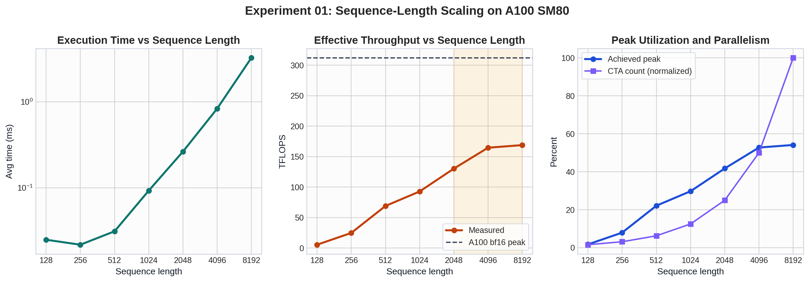
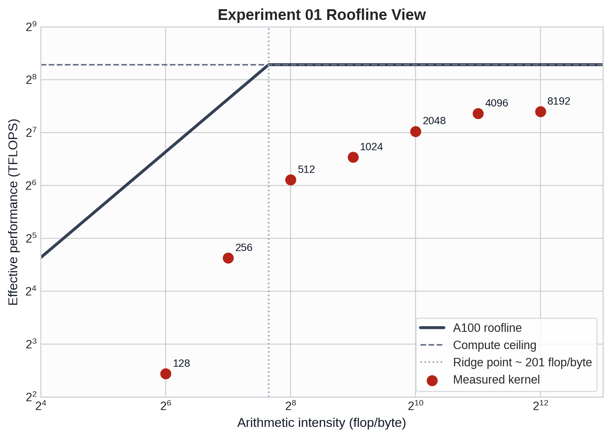
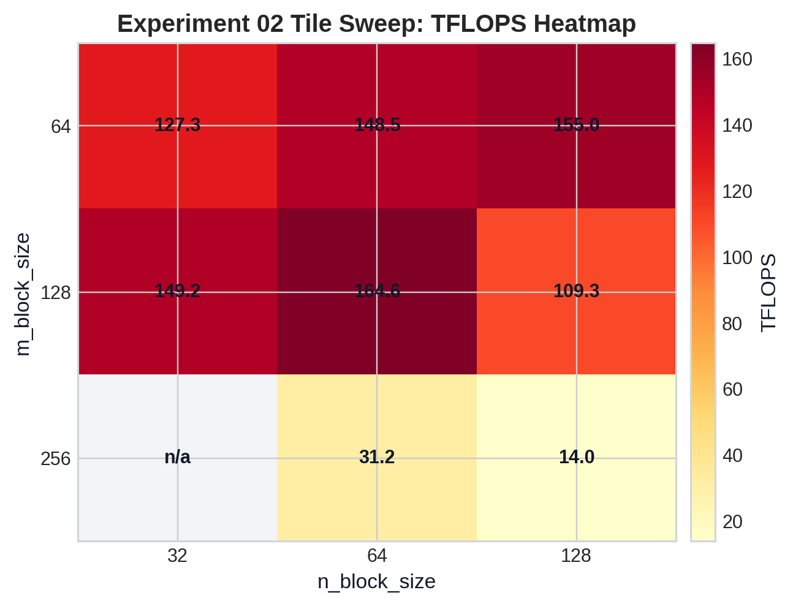
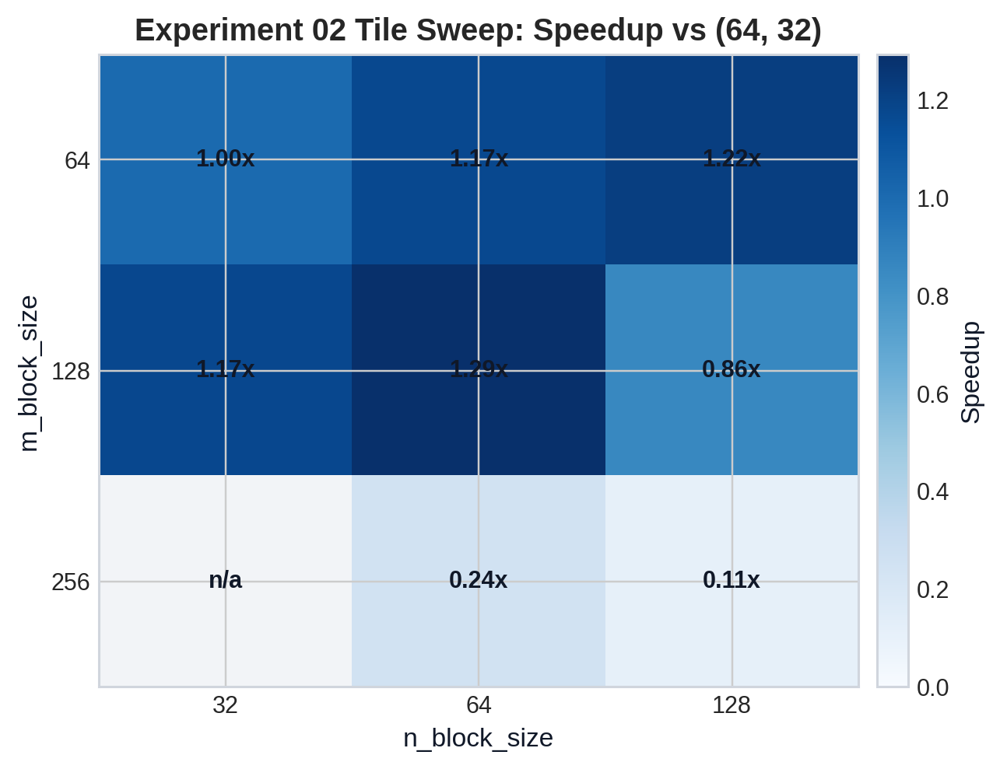
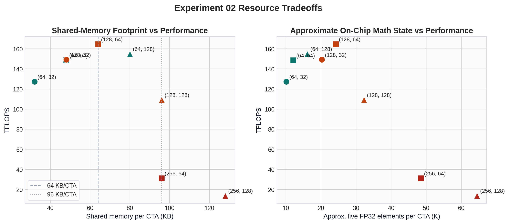

# FlashAttention v2 Ampere CuTe DSL: Experiment 01 and 02 Report

This report packages the first two experiments into a plot-first narrative for A100 SM80. The immediate goal is to generate reusable visual assets for a later video about performance scaling, roofline behavior, and kernel tradeoffs.

Generated plot assets live in `plots/` next to this report.

## Asset Index

- `plots/exp01_scaling_dashboard.png`
- `plots/exp01_roofline.png`
- `plots/exp02_tflops_heatmap.png`
- `plots/exp02_speedup_heatmap.png`
- `plots/exp02_tradeoff_dashboard.png`

## A100 Context

- GPU: `NVIDIA A100-SXM4-40GB`
- Architecture: `SM80`
- Nominal bf16 tensor-core peak used here: `312 TFLOPS`
- Nominal HBM bandwidth used for roofline framing: `1.555 TB/s`
- Roofline ridge point from those constants: about `201 flop/byte`

The effective TFLOPS reported by these experiments are kernel-level throughput estimates, not raw tensor-core counters. The timing includes global-memory movement, shared-memory movement, barriers, online softmax, and epilogue work in addition to the two GEMMs.

## Experiment 01: Sequence-Length Scaling

Fixed parameters:

- `B=1`
- `H=16`
- `D=128`
- `m_block=128`
- `n_block=64`
- `threads=128`
- dense attention

### Plots

### Key Reading

The short-sequence regime is not only memory-bound. It is also underfilled. With `m_block=128`, the kernel launches `ceil(seqlen / 128) * 16` CTAs. That gives only `16`, `32`, and `64` CTAs for sequence lengths `128`, `256`, and `512`. On an A100 with 108 SMs, that is not enough work to keep the machine busy.

By `seqlen=2048`, the kernel has `256` CTAs and enough inner-loop length over K/V tiles to reach a much steadier regime. That is where the effective throughput moves into the `130+ TFLOPS` range and then flattens.

The `4096` and `8192` points are the most representative steady-state points in this run:

- `4096`: `164.6 TFLOPS`
- `8192`: `168.8 TFLOPS`

That is about `53%` to `54%` of the nominal `312 TFLOPS` bf16 peak. This is reasonable for a fused attention kernel whose measured time includes:

- `cp.async` global-to-shared staging
- `ldmatrix` shared-to-register movement
- online softmax updates
- synchronization and predicate handling
- output normalization and stores

The roofline chart should be interpreted as a trend plot, not a literal hardware counter plot. The arithmetic-intensity axis is the experiment's simplified proxy, so it is useful for showing the transition direction, but it is not a full end-to-end DRAM traffic model.

### What The Plots Show

- `exp01_scaling_dashboard.png`
  Shows the three most useful video curves for this sweep: execution time, effective TFLOPS, and achieved-peak percentage. The key story is that throughput rises sharply until roughly `seqlen=4096`, then plateaus.
- `exp01_roofline.png`
  Shows the same points on a roofline framing. The measured points cross the ridge region and then move toward the compute ceiling without reaching it. That is the expected shape for a kernel that becomes compute-heavier as sequence length grows but still pays fusion overheads.

### Derived Table

| seqlen | total CTAs | avg ms | TFLOPS | achieved peak |
| --- | ---: | ---: | ---: | ---: |
| 128 | 16 | 0.0248 | 5.42 | 1.7% |
| 256 | 32 | 0.0217 | 24.73 | 7.9% |
| 512 | 64 | 0.0311 | 68.99 | 22.1% |
| 1024 | 128 | 0.0926 | 92.79 | 29.7% |
| 2048 | 256 | 0.2638 | 130.26 | 41.8% |
| 4096 | 512 | 0.8350 | 164.60 | 52.8% |
| 8192 | 1024 | 3.2565 | 168.82 | 54.1% |

### Recommended Video Story For Experiment 01

1. Start with the time curve to show the cost explosion as sequence length grows.
2. Cut to the TFLOPS curve to show that the kernel is actually becoming more efficient as the work gets larger.
3. End on the roofline plot to explain why the curve rises and then flattens.

The strongest narration point is: "Longer sequences cost more in absolute time, but the kernel itself runs better because the GPU is finally busy and the fused pipeline is amortized."

## Experiment 02: Tile Size Sweep

Fixed parameters:

- `seqlen_q = seqlen_k = 4096`
- `B=1`
- `H=16`
- `D=128`
- `threads=128`
- dense attention

### Plots

### Key Reading

This sweep is about the kernel's main microarchitectural knob: tile shape.

The best point in this run is:

- `(m, n) = (128, 64)` at `164.6 TFLOPS`

That is not an accident. It balances three competing effects:

- larger tiles improve reuse and reduce loop overhead
- larger tiles increase shared-memory footprint
- larger tiles also increase on-chip math state, especially the live accumulators and row-wise softmax state

The sweep shows three distinct regimes.

#### 1. Small tiles: safe but not optimal

`(64, 32)` is the weakest legal point at `127.3 TFLOPS`. It uses only `32 KB` of shared memory per CTA, but it processes the problem with many more K/V tile iterations and lower reuse. Increasing `n` from `32` to `64` to `128` at `m=64` steadily improves performance.

#### 2. Moderate tiles: sweet spot

`(128, 32)` and especially `(128, 64)` are the sweet spot. They amortize the Q tile and online-softmax overhead much better, while staying within a manageable shared-memory and accumulator footprint.

#### 3. Oversized tiles: resource cliff

`(128, 128)` drops to `109.3 TFLOPS`, and `m=256` collapses much harder:

- `(256, 64)`: `31.2 TFLOPS`
- `(256, 128)`: `14.0 TFLOPS`

This is the most important result in the sweep. Shared memory alone does not explain it.

`(128, 128)` and `(256, 64)` both use `96 KB` of shared memory, but their performance is radically different. That points to a second limiter beyond SMEM: the on-chip math-state footprint grows strongly with `m`.

In this kernel, that state includes:

- the `acc_S` tile, which scales with `m * n`
- the `acc_O` tile, which scales with `m * d`
- the row-wise `row_max` and `row_sum` state, which scales with `m`

That is why the tradeoff dashboard includes a second panel for approximate live FP32 elements per CTA. It is not a literal register count, but it is a useful proxy for how much live math state the CTA carries while it pipelines MMA, softmax, and the output update.

### What The Plots Show

- `exp02_tflops_heatmap.png`
  This is the best overview plot for the sweep. It shows the sweet spot at `(128, 64)` and the performance cliff once `m` becomes too large.
- `exp02_speedup_heatmap.png`
  This normalizes the sweep against `(64, 32)`, which is useful for narration. The best point is about `1.29x` faster, while the worst legal point is only about `0.11x` of the baseline speed.
- `exp02_tradeoff_dashboard.png`
  The left panel shows that more shared memory is not automatically better. The right panel shows why the very large `m` values are dangerous: performance falls as the per-CTA live math state gets too large.

### Derived Table

| config | smem KB | total CTAs | K/V tiles per CTA | SMEM CTA limit per SM | approx live FP32 elems / CTA | TFLOPS |
| --- | ---: | ---: | ---: | ---: | ---: | ---: |
| `(64, 32)` | 32 | 1024 | 128 | 5 | 10.1K | 127.3 |
| `(64, 64)` | 48 | 1024 | 64 | 3 | 12.1K | 148.5 |
| `(64, 128)` | 80 | 1024 | 32 | 2 | 16.1K | 155.0 |
| `(128, 32)` | 48 | 512 | 128 | 3 | 20.2K | 149.2 |
| `(128, 64)` | 64 | 512 | 64 | 2 | 24.2K | 164.6 |
| `(128, 128)` | 96 | 512 | 32 | 1 | 32.2K | 109.3 |
| `(256, 64)` | 96 | 256 | 64 | 1 | 48.5K | 31.2 |
| `(256, 128)` | 128 | 256 | 32 | 1 | 64.5K | 14.0 |

### Recommended Video Story For Experiment 02

1. Open with the TFLOPS heatmap so the viewer sees the sweet spot immediately.
2. Move to the speedup heatmap to quantify the improvement and the cliff.
3. Finish with the tradeoff dashboard to explain why the cliff happens.

The strongest narration point is: "Tile size is not a monotonic knob. Bigger tiles help until shared-memory pressure and live accumulator state start to choke the kernel."

## How Experiment 01 and 02 Fit Together

Use the two experiments as different layers of the same story:

- Experiment 01 is the global roofline story.
  It explains why the kernel gets more efficient as the problem becomes larger.
- Experiment 02 is the microarchitecture story.
  It explains why, even at one fixed large sequence length, some tile shapes get much closer to the steady-state limit than others.

That split is useful for the final video:

- `exp_01` provides the high-level performance curve and roofline anchor.
- `exp_02` provides the concrete kernel-control knob and the visual explanation of the sweet spot.

## Notes For The Next Iteration

For the next batch of report assets, the most useful additions would be:

- thread-count sweep plots from `exp_03`
- head-dimension sweep plots from `exp_04`
- a causal-vs-dense comparison from `exp_06`
- an overlay that places each experiment's best point onto a shared roofline frame

That would make the final video transition naturally from sequence scaling to tile selection, then to occupancy, datatype, and masking effects.
